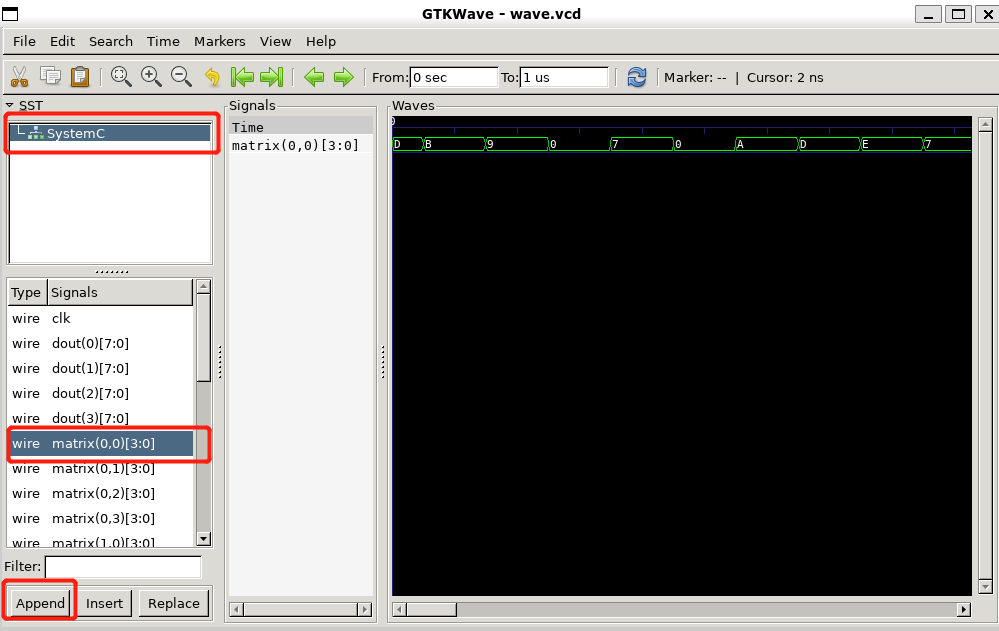

# SystemC 环境搭建


### 安装环境

​	推荐使用linux（Ubuntu）环境，Windows系统可以使用WSL子系统


### 编译安装

1. 下载安装包：https://accellera.org/images/downloads/standards/systemc/systemc-2.3.3.tar.gz
2. 解压并创建临时文件夹，临时文件夹objdir用于存放安装过程中产生的临时文件

```bash
tar -zxvf systemc-2.3.3.tar.gz
cd systemc-2.3.3
mkdir objdir
cd objdir
```

3. 创建并指定安装目录。可以安装到其他目录，但指定的安装目录必须存在。注意选项--prefix指定的路径名须为绝对路径。该步骤成功结束后，会出现编译信息，如Architecture, Compiler, Build settings 等。

```bash
mkdir /usr/local/systemc
../configure --prefix=/usr/local/systemc
```

4. 编译安装，该步骤时间较长。完成后，安装目录下出现安装文件

```bash
make
sudo make install
```

5. 将systemc的include、lib文件添加到系统环境变量中。该步骤也可省略，若不设置环境变量，则需要在编译命令中通过选项设置库文件以及头文件路径，推荐使用Makefile

```bash
echo "export LD_LIBRARY_PATH=/usr/local/systemc/lib-linux64:\$LD_LIBRARY_PATH" >> ~/.bashrc
echo "export LIBRARY_PATH=/usr/local/systemc/lib-linux64:\$LIBRARY_PATH" >> ~/.bashrc
echo "export CPLUS_INCLUDE_PATH=/usr/local/systemc/include:\$CPLUS_INCLUDE_PATH" >> ~/.bashrc
source ~/.bashrc
```


### 开发测试

1. 推荐使用 vscode & C/C++插件 & 命令行 的方式进行开发编译运行；
2. 在编写的项目代码中，加入 `#include <systemc.h>`，即可在代码使用SystemC；
3. 编译时，需要在 `g++` 命令中加入参数 `-lsystemc`，指定动态链接库；推荐使用Makefile，一个简单的Makefile文件示例如下：

```makefile
CC     = g++
OPT    = -O2 # -O3
DEBUG  = -g
OTHER  = -Wall -Wno-deprecated
CFLAGS = $(OPT) $(OTHER)
SYSTEMC = /usr/local/systemc		# 之前指定的SystemC安装目录
INCDIR = -I$(SYSTEMC)/include
LIBDIR = -L$(SYSTEMC)/lib-linux64
LIBS = -lsystemc
APP=xxx.o				# 编译目标文件名
SRCS=xxx.cpp yyy.cpp	# 编译源文件
all:
	g++ -o $(APP) $(SRCS) $(LIBDIR) $(INCDIR) $(LIBS)
clean:
	rm -rf *.o
```

4. 运行生成的vcd波形文件，可用gtkwave进行查看，gtkwave是一个轻量的仿真波形查看软件

+ 可通过如下命令安装：

```bash
sudo apt-get install gtkwave
```

+ 通过如下命令运行，假定生成的波形文件为wave.vcd：

```bash
gtkwave wave.vcd
```

+ 运行后，出现下图界面。点击左侧 SystemC，即在下方出现信号名称。选择信号，点击 Append，则可在右侧查看该信号。

